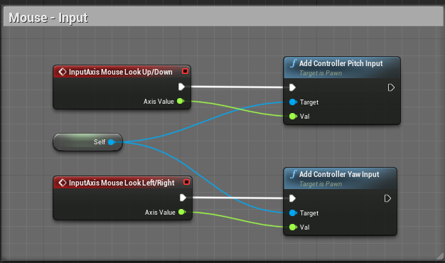
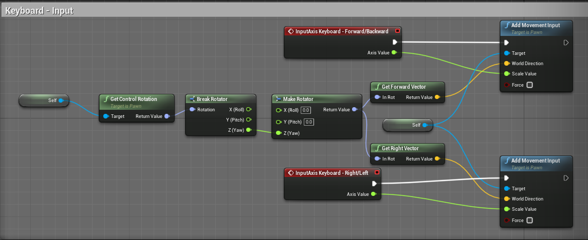
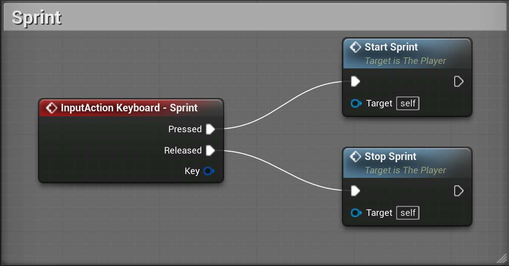
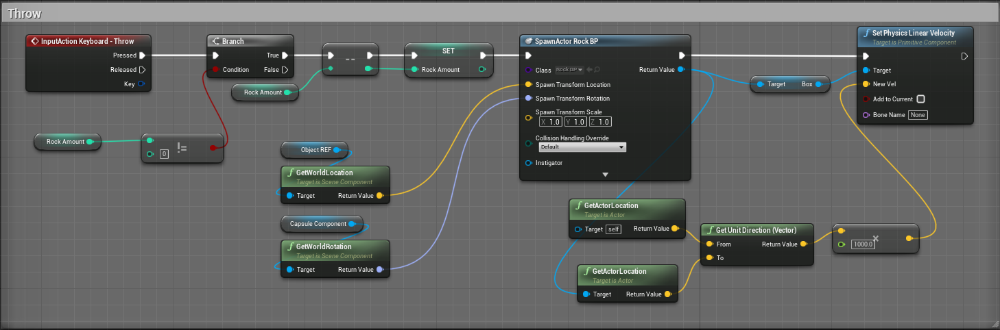

#### ➡️ Click [here](https://github.com/algosup/2022-2023-project-4-game-design-Team-1/blob/main/README.md) to go to the README file

# Technical Specifications

> EA, Microsoft, Sony, Ubisoft and other large game companies are highly process-driven and require heavy documentation. It's a big part of how they have achieved success over and over again.

## Author

### [**`Alexandre BOBIS`**](https://github.com/AlexandreBobis)

### *Tech Lead*

  

    📖 Table of Contents

- [Technical Specifications](#technical-specifications)
  - [Author](#author)
    - [**`Alexandre BOBIS`**](#alexandre-bobis)
    - [*Tech Lead*](#tech-lead)
  - [Project Title: *Mind Maze: Jail Escape Edition*](#project-title-mind-maze-jail-escape-edition)
  - [I. 🛠️ Technical Section](#i-️-technical-section)
    - [1. Project Overview](#1-project-overview)
    - [2. User Stories](#2-user-stories)
      - [2.1 🔸 Sarah](#21--sarah)
      - [2.2 🔸 John](#22--john)
      - [2.3 🔸 Lisa](#23--lisa)
    - [3. Scope](#3-scope)
    - [4. Design and Implementation Plan](#4-design-and-implementation-plan)
    - [5. Prototype](#5-prototype)
    - [6. Test/Demo Plan](#6-testdemo-plan)
    - [7. Delivery Platform \& Hardware - Software Requirements](#7-delivery-platform--hardware---software-requirements)
    - [8. Marketing \& Fundings](#8-marketing--fundings)
      - [8.1 🔸 Platforms \& Monetization](#81--platforms--monetization)
      - [8.2 🔸 Localization](#82--localization)
    - [9. Other Ideas](#9-other-ideas)
  - [II. 🖥️ Game Section](#ii-️-game-section)
    - [1. Characters](#1-characters)
    - [2. Story](#2-story)
      - [2.1 Theme](#21-theme)
      - [2.2 Story Progression](#22-story-progression)
    - [3. Gameplay](#3-gameplay)
      - [3.1 🔸 Goals](#31--goals)
      - [3.2 🔸 User Skills](#32--user-skills)
      - [3.3 🔸 Game mechanics](#33--game-mechanics)
      - [3.4 🔸 Progression and challenge](#34--progression-and-challenge)
      - [3.5 🔸 Losing](#35--losing)
  - [III. 🎨 GDD\[^3\] Section](#iii--gdd3-section)
    - [1. List of features captured](#1-list-of-features-captured)
    - [2. Choice of game engine](#2-choice-of-game-engine)
    - [3. Diagrams (flowcharts) to Illustrate Mechanics Design](#3-diagrams-flowcharts-to-illustrate-mechanics-design)
      - [3.1 🔸 Buttons Enigma Flowchart](#31--buttons-enigma-flowchart)
      - [3.2 🔸 Piano Enigma Flowchart](#32--piano-enigma-flowchart)
      - [3.3 🔸 Statue Enigma Flowchart](#33--statue-enigma-flowchart)
      - [3.4 🔸 Guard Flowchart](#34--guard-flowchart)
    - [4. Art tools (if there)](#4-art-tools-if-there)
    - [5. 3D Objects, Terrain, \& Scene Management](#5-3d-objects-terrain--scene-management)
    - [6. Collision Detection, Physics \& Interaction](#6-collision-detection-physics--interaction)
    - [7. Audio \& Visual Effects](#7-audio--visual-effects)
  - [Glossary](#glossary)

## Project Title: *Mind Maze: Jail Escape Edition*

## I. 🛠️ Technical Section

### 1. Project Overview

The goal of this project is to provide a video game.
In addition, we need to be careful about the game design[^1] of our product.
This video game is an escape video game.
An escape game is a type of adventure game where the player is typically trapped or imprisoned in a specific location, and the main objective of the game is to escape from that location. This location can take many forms, such as a jail cell, a haunted house, a laboratory, or even a spaceship.

The player will need to explore the location, gather clues, solve puzzles, and interact with objects to unlock doors, find keys, and discover hidden passages. The puzzles and challenges can be presented in various forms, such as ciphers, and other types of brain teasers.

### 2. User Stories

#### 2.1 🔸 Sarah

Sarah loves escape rooms and the challenge of solving puzzles. She's been to several escape rooms with friends and always enjoys the rush of adrenaline she gets when they finally solve the puzzle and escape the room. She enjoys the teamwork involved in solving puzzles and feels a great sense of accomplishment when they successfully escape.

#### 2.2 🔸 John

John has played several puzzle games on his phone and computer. He likes the mental challenge of figuring out solutions to complex problems. He enjoys games that make him think and require him to use his problem-solving skills. He likes to challenge himself and sees puzzle games as a fun way to do that.

#### 2.3 🔸 Lisa

Lisa has never played an escape room or puzzle game before but has heard good things from friends. She's always enjoyed solving problems and thinks a puzzle game would be a good way to challenge herself. She's excited to try one out and see if it's something she enjoys. She's looking forward to using her problem-solving skills to figure out the puzzles and escape the room.

### 3. Scope

### 4. Design and Implementation Plan

- Game Design Document Delivery Date: 2023-03-03
- Prototype Delivery Date: 2023-03-10
- Final Product Delivery Date: 2023-04-13

### 5. Prototype

The prototype consists of an Inky[^2] story (.ink)
This one is composed of 3 puzzles to solve, 2 available directly on a computer and the last one requires a material presence to be able to complete it.
The second part of the prototype is an Unreal Engine scene representing a guard moving randomly in the scene.
If you want to access the prototype, click ➡️ [here](https://github.com/algosup/2022-2023-project-4-game-design-Team-1/blob/prototype/README.md) ⬅️

### 6. Test/Demo Plan

### 7. Delivery Platform & Hardware - Software Requirements

The delivery harware will be computers like Windows, MacOS and Linux.
Steam or Epic Games Store will be the main platforms.

### 8. Marketing & Fundings

#### 8.1 🔸 Platforms & Monetization

The main devices are PC like Windows, Mac and Linux. The game will be on 2 different platforms: Steam and Epic Games Store. The game will be free to play.

#### 8.2 🔸 Localization

The game will be in english. So anyone who speaks English will be able to play.

### 9. Other Ideas

We thought about adding a multiplayer mode where you can play with your friends.
We also thought about new mazes and new puzzles.

## II. 🖥️ Game Section

### 1. Characters

The player will be able to control a character. This character will be able to interact with the environment that's to say it will be able to move, jump, interact with objects, his inventory, etc.

### 2. Story

#### 2.1 Theme

The story takes place in a prison, our player must escape from this prison and will have to solve the puzzles that will stand on his way.

#### 2.2 Story Progression

By completing a puzzle and depending on his progress, the player will unlock or not new accessible parts in the prison.

### 3. Gameplay

#### 3.1 🔸 Goals

The first goal of the player is to escape from the prison.
The second goal of the player is to solve the puzzles that will stand in his way.
To achieve his primary objective, the player will therefore have to finish his secondary objective first.

#### 3.2 🔸 User Skills

The user should be able to know what an escape game is.
The user should be able to speak English.
The user should be able to manipulate a computer with keyboard and mouse.

#### 3.3 🔸 Game mechanics

Here is a list of the game mechanics that (are implemented (✅)) - (are not implemented(❎)) in the game:

| Mechanics | Type | Goal of the mechanic | In game ? |
| :--- | :--- | :--- | :--- |
| Enigma | Story | A lot of enigmas across the map. The player needs to answer them to escape the jail | ✅ |
| Rock | Gameplay | Catchable object. Allows to distract and destroy | ✅ |
| Destroyable wall | Contact | Throw a pebble at the small wall to reveal a clue for the puzzle | ✅ |
| Friend | Narrative Clue | The player can talk to a friend to get a clue for the puzzle. The friend will be a rat | ❎ |
| Flashlight | Gameplay | Can use a flashlight to light up and when he will have to find battery | ❎ |
| Beanbag Gun | Gameplay | After stealing it from a guard he can use it to knock out other guards | ❎ |
| Hidden Object Hunting | Search & Find | The player must explore the jail environment to find hidden objects that will help them solve the enigmas and escape the prison | ❎ |
| Stealth | Avoidance | The player must avoid guards and other obstacles while navigating the prison. They may need to sneak past guards, hide behind objects, or distract guards to progress | ✅ |
| Time-based challenges | Timed | The player must complete certain tasks within a set amount of time, such as escaping their cell before the guards return from their patrol | ❎ |

#### 3.4 🔸 Progression and challenge

The player will have to solve the puzzles that will stand in his way to escape the prison.
The following table shows the enigmas and their difficulty:

| Enigma | Goal of the enigma | Difficulty (1:"easy" - 2 :"hard") |
| :--- | :--- | :--- |
| Buttons | Click on buttons in the right order | 1 |
| Piano | A piece of music will be given to our player | 1 |
| Statue | The player will need to complete the statue by finding the different parts of it | 2 |

#### 3.5 🔸 Losing

The player will lose if he gets caught by the guards.

## III. 🎨 GDD[^3] Section

### 1. List of features captured

### 2. Choice of game engine

The choice of game engine has been predefined: Unreal Engine 4.27[^4].
Unreal Engine 4.27 comes with several advantages, some of which include:

- Improved Visual Fidelity: Unreal Engine 4.27 provides developers with enhanced visual quality and fidelity, enabling them to create highly realistic and immersive games and experiences.

- MetaSounds Audio Engine: The new MetaSounds audio engine offers advanced sound design capabilities with an intuitive visual scripting interface. It allows for greater control and flexibility in designing and implementing sound effects in games.

- Niagara VFX: The Niagara visual effects system has been improved with new features, allowing developers to create stunning particle effects, fluid simulations, and other visual effects.

- Improved Animation Workflow: Unreal Engine 4.27 includes several enhancements to the animation system, including new blend spaces, improved animation compression, and better support for root motion.

- Scalability and Performance: The engine provides better scalability and performance, with optimized rendering, animation, and physics systems that can run smoothly on a wide range of devices.

- MetaHuman Creator: The MetaHuman Creator is a tool that allows developers to create highly realistic human characters with ease, using a variety of customization options.

- Virtual Production: Unreal Engine 4.27 includes several updates to the virtual production workflow, including support for LED walls, improved camera tracking, and real-time compositing capabilities.

Overall, these features make Unreal Engine 4.27 a powerful tool for game development, virtual production, and other industries that require high-quality, immersive experiences.

### 3. Diagrams (flowcharts) to Illustrate Mechanics Design

#### 3.1 🔸 Buttons Enigma Flowchart

#### 3.2 🔸 Piano Enigma Flowchart

#### 3.3 🔸 Statue Enigma Flowchart

#### 3.4 🔸 Guard Flowchart

### 4. Art tools (if there)

We uses [Miro](https://miro.com/fr/) to create the flowcharts.

### 5. 3D Objects, Terrain, & Scene Management

### 6. Collision Detection, Physics & Interaction

Blueprint[^5] representation of mouse inputs:

Blueprint representation of keyboard inputs:

Blueprint representation of sprint:

Blueprint representation of throwing an object:

### 7. Audio & Visual Effects

Blueprint representation of grabing an object:

Blueprint representation when the rock touches something:

## Glossary

[^1]: **Game design** is the process of creating and shaping the mechanics, systems, and rules of a game. Games can be created for entertainment, education, exercise, or experimental purposes. Increasingly, elements and principles of game design are also applied to other interactions, in the form of gamification.

[^2]: [**Inky**](https://www.inklestudios.com/ink/) is a storytelling tool developed by [Inkle](https://www.inklestudios.com/) that allows authors to create interactive stories with complex branching storylines and multiple outcomes. It's highly customizable and provides debugging and testing tools for authors. It's perfect for creating text-based adventure games and visual novels.

[^3]: **GDD** = Game Design Document
A Game Design Document (GDD) is a highly descriptive living software design document of the design for a video game. It is created and edited by the development team as result of collaboration between their designers, artists and programmers as a guiding vision which is used throughout the game development process to organize efforts within a development team.

[^4]: [**Unreal Engine**](https://www.unrealengine.com/en-US) (UE) is a game engine designed by [Epic Games](https://www.epicgames.com/site/fr/home?sessionInvalidated=true) that utilizes 3D computer graphics, and was initially presented in the 1998 first-person shooter game, Unreal. Originally developed for PC first-person shooter games, it has since been employed in various gaming genres and has been embraced by other industries, such as the film and television industry. Written in C++, Unreal Engine has great adaptability, supporting numerous platforms including desktop, mobile, console, and virtual reality platforms. Blueprints are also available in Unreal Engine.

[^5]: **Blueprint** is a visual scripting system that allows designers and artists to create gameplay logic without writing code. It is a node-based system that allows designers to create gameplay logic by connecting nodes together.
